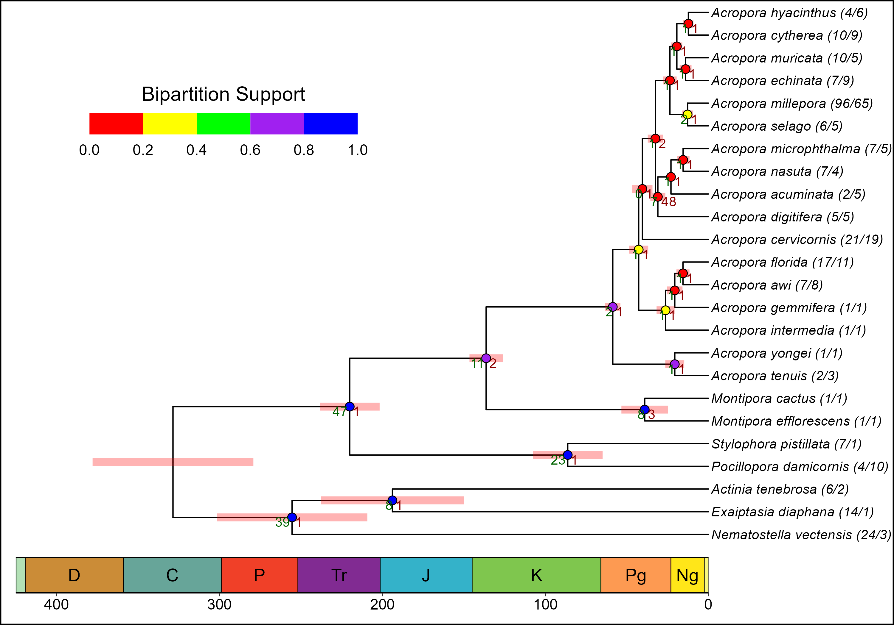
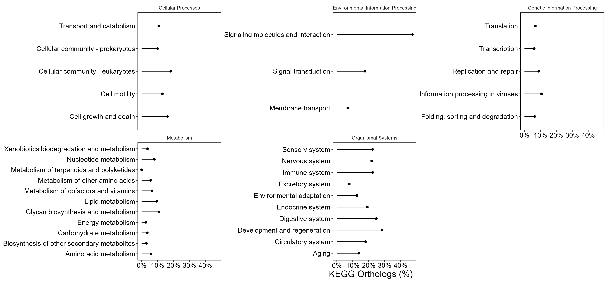
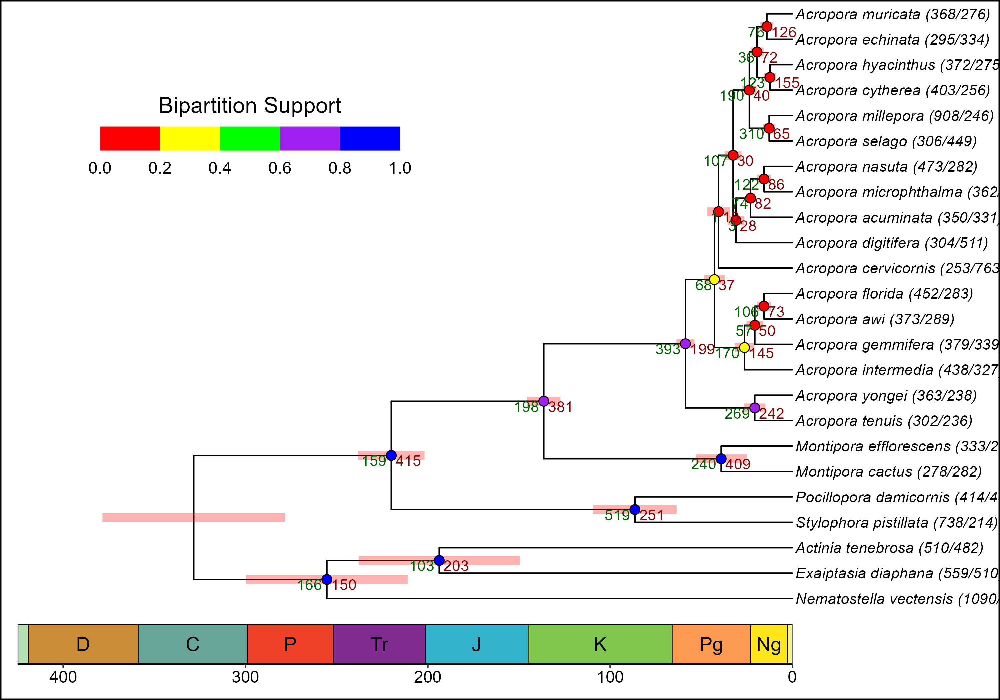
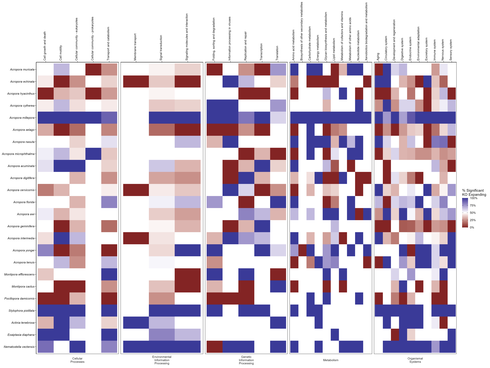

# Acerv_Genome
 Compare A. cervicornis genome to other anthazoans

Add composition/mito etc.

## Phylogeny
Time calibrated tree using [Orthofinder](https://github.com/davidemms/OrthoFinder) & [LSD2](https://github.com/tothuhien/lsd2). Time calibration is based on [fossil evidence](Data/fossil_estimates.txt)

## Expansions/Contractions of the number of unique KEGG orthologs found within each KEGG pathway in each Species
[Cafe5](https://github.com/hahnlab/CAFE5) analysis of change in number of unique [KEGG Orthologs](https://www.genome.jp/kegg/ko.html) within [KEGG pathways](https://www.genome.jp/kegg/pathway.html). A total of 324 KEGG pathways were analyzed.

Relative percentage pathways within each KEGG minor category with significantly changing number of orthogroups across the tree:

Number of KEGG pathways which expanded/contracted at each node in tree

[KEGG Pathways showing significant changes in the number of KEGG Orthologs found within species](Results/significantly_evolving_pathways.html)

[KEGG Pathways showing significant changes in the number of KEGG Orthologs at important splits in the Anthozoan Tree](Results/pathway_changes_nodes.html)

## Expansions/Contractions of the number of gene copies of each KEGG orthologs found within each Species
A total of 2,595 KEGG Orthologs were analyzed.
Relative percentage KEGG Orthologs within each KEGG minor category with significantly changing number of gene copies across the tree:

Number of KEGG pathways which expanded/contracted at each node in tree

[Orthologs showing significant changes in the number of gene copies found within species](Results/significantly_evolving_ko.html)

[Orthologs showing significant at important splits in the Anthozoan Tree](Results/ko_changes_nodes.html)

Percent of KEGG orthologs significantly changing at the tips either increasing (100) or decreasing (0) or equal frequency (50%)
 
