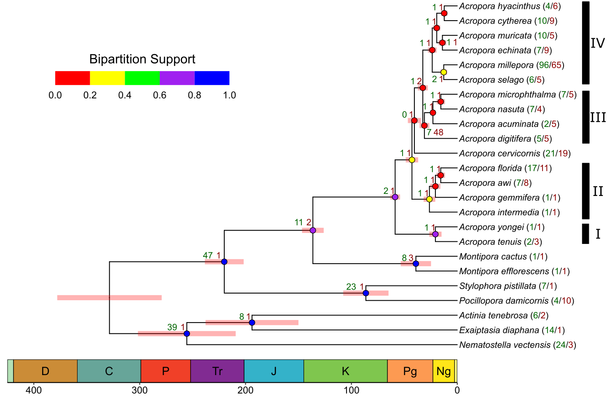
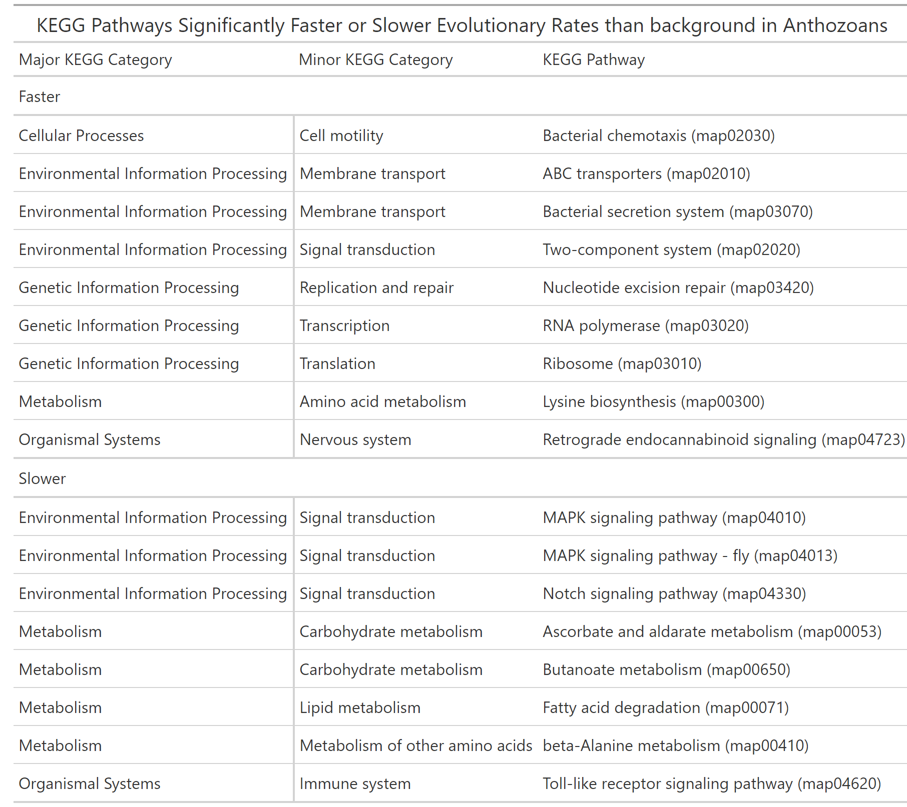

# Comparative_Genomics
 Compare A. cervicornis genome to other anthazoans

Add composition/mito etc.

## Phylogeny
Time calibrated tree using [Orthofinder](https://github.com/davidemms/OrthoFinder) & [LSD2](https://github.com/tothuhien/lsd2). Time calibration is based on [fossil evidence](Data/fossil_estimates.txt)

## Comparative Cafe/KEGG
[Cafe5](https://github.com/hahnlab/CAFE5) analysis of change in number of unique [KEGG Orthologs](https://www.genome.jp/kegg/ko.html) within [KEGG pathways](https://www.genome.jp/kegg/pathway.html). Assuming multiple possible evolutionary rate groups (gamma)

Given 4 distinct groups of gene evolving at different rates the number of categories with significant changes relative

Number of KEGG pathways which expanded/contracted at each node in tree

## KEGG Evolutionary Rates
KEGG Pathways evolving at a rate faster/slower than the background rate of evolution in the Anthozoans

