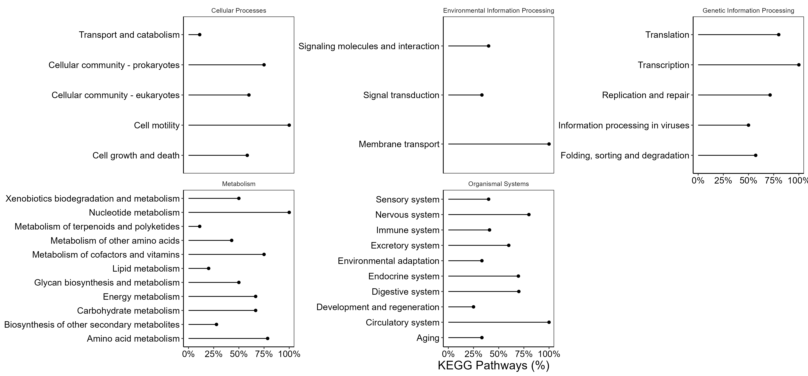

# Comparative_Genomics
 Compare A. cervicornis genome to other anthazoans

Add composition/mito etc.

## Phylogeny
Time calibrated tree using [Orthofinder](https://github.com/davidemms/OrthoFinder) & [LSD2](https://github.com/tothuhien/lsd2). Time calibration is based on [fossil evidence](Data/fossil_estimates.txt)

## Comparative Cafe/KEGG
[Cafe5](https://github.com/hahnlab/CAFE5) analysis of change in number of genes within Orthofinder derived [KEGG pathways](https://www.genome.jp/kegg/pathway.html). Filtered to only test pathways with a maximum spread of 100 gene difference across species (any greater and the cafe model doesn't fit).

